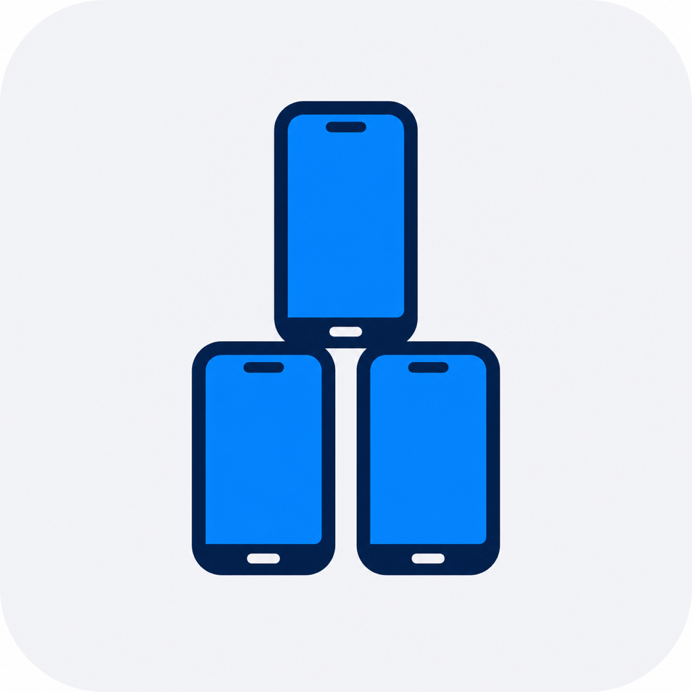

<div align="center">
  

  <h1><strong>SimLease</strong></h1>

  <p>
    <strong>Safe, conflict-free iOS Simulator sharing for concurrent coding agents.</strong>
    <br>
    Kernel-backed leases, isolated Derived Data, and zero server infrastructure.
  </p>
</div>

<br>

<div align="center">
  <a href="https://yadaniyil.github.io/SimLease/install/"><strong>Open SimLease in Codex →</strong></a>
  <br>
  <sub>No terminal commands required.</sub>
</div>

<br>

SimLease safely shares booted iOS Simulators between concurrent coding agents on the same Mac. It uses macOS `lockf` kernel locks as the source of truth, keeps human-readable JSON lease metadata, and gives each workspace and simulator an isolated Derived Data path.

The repository ships both a Codex marketplace plugin and a standalone Bash CLI. No database or MCP server is required.

## Install the Codex plugin

The easiest option is [Open SimLease in Codex](https://yadaniyil.github.io/SimLease/install/). Press Send when Codex opens, then follow the one-time hook trust instruction.

Give Codex this prompt:

> Install the SimLease plugin from `https://github.com/yadaniyil/SimLease`, then use it for every iOS Simulator operation.

Codex can perform the equivalent manual installation:

```bash
codex plugin marketplace add yadaniyil/SimLease --ref main
codex plugin add simlease@simlease
```

Start a new Codex task after installation so the `simlease` skill is loaded. Open `/hooks` once and trust the SimLease hook. The plugin then activates automatically for iOS Simulator work and blocks normal Codex tool calls that bypass a lease. The plugin bundles the CLI; it does not require a separate Homebrew install or expect `simlease` on `PATH`.

For local development, install directly from this checkout:

```bash
codex plugin marketplace add "$(pwd)"
codex plugin add simlease@simlease
```

## Install the standalone CLI

```bash
git clone https://github.com/yadaniyil/SimLease.git
cd SimLease
./scripts/install.sh
```

The installer runs a dependency preflight and installs to `~/.local/bin/simlease`. Choose another prefix with `./scripts/install.sh --prefix /usr/local`.

## Requirements

- macOS with Xcode command-line tools
- Bash
- `jq`
- `install`, `launchctl`, `lockf`, `shasum`, and `uuidgen` from macOS
- At least one available iOS Simulator device; SimLease can boot one when memory permits

Check a machine without acquiring a lease:

```bash
./plugins/simlease/skills/simlease/scripts/preflight
```

## CLI usage

```bash
LEASE_JSON="$(./bin/simlease acquire \
  --owner "agent-one" \
  --purpose "Test the settings screen" \
  --ttl 3600 \
  --boot-if-needed \
  --json)"

TOKEN="$(printf '%s' "$LEASE_JSON" | jq -r '.token')"

./bin/simlease exec --token "$TOKEN" -- sh -c '
  xcodebuild -project Example.xcodeproj \
    -scheme Example \
    -destination "id=$SIMULATOR_UDID" \
    -derivedDataPath "$DERIVED_DATA_PATH" \
    build
'

./bin/simlease release --token "$TOKEN"
```

Available commands:

```text
simlease acquire --owner NAME [--purpose TEXT] [--device UUID]
                 [--ttl SECONDS] [--wait SECONDS] [--boot-if-needed]
                 [--token-file PATH] [--json]
simlease status [--json]
simlease renew --token TOKEN [--ttl SECONDS] [--json]
simlease release --token TOKEN [--json]
simlease exec --token TOKEN -- COMMAND [ARG ...]
```

`simlease exec` validates and renews the lease, then exports `SIMULATOR_UDID`, `SIMULATOR_NAME`, `DERIVED_DATA_PATH`, and `SIMLEASE_TOKEN`. It keeps renewing the lease at a third of its TTL for as long as the command runs, so a long `flutter run` or test run does not lose its Simulator when the TTL passes. Renewal stops when the command exits.

`acquire --token-file PATH` also writes the token to a private file, and `renew`, `release` and `exec` accept `--token-file PATH` in place of `--token`. Acquire refuses a file that still holds an active lease's token, so a second acquire cannot overwrite the only copy and leak the first lease.

## How coordination works

1. SimLease discovers booted simulators using `simctl`.
2. Each simulator UUID has its own `lockf` lock file.
3. Acquisition submits a one-shot guard to the user's `launchd` domain, outside the acquiring command's process tree.
4. The guard holds the lock for the lease lifetime, and JSON metadata records its owner, purpose, expiry, workspace, PID, and launchd label.
5. A second cooperating process cannot acquire the same kernel lock.
6. When every running Simulator is busy, `--boot-if-needed` checks macOS memory pressure and a RAM-derived pool limit before starting one more device.
7. Release signals the guard; expiry or stale-lease cleanup makes the simulator available again.
8. If SimLease started that device, cleanup shuts it down to return its RAM. Devices that were already running are never shut down automatically.

By default, a new Simulator requires at least 4 GB and 15% free memory. With [simslim](https://github.com/mobai-app/simslim) installed, the pool cap is two booted Simulators below 16 GB total RAM, three below 32 GB, four below 64 GB and six at 64 GB; without it, one, two and three. Advanced users can tune `SIMLEASE_MIN_FREE_MEMORY_MB`, `SIMLEASE_MIN_FREE_MEMORY_PERCENT`, `SIMLEASE_MAX_BOOTED_SIMULATORS` and `SIMLEASE_MAX_EMULATORS`.

## Slim Simulators

When `simslim` is on `PATH`, every acquire makes the leased Simulator match one shared profile, `~/.config/simlease/simslim-profile.json` (`{"except": [...], "keep": [...]}`, created by the installer with `photos`, `store`, `icloud` and `web` kept). A matching Simulator costs a one-second check; any other is reconfigured and rebooted slim once, in 10-25 s. A slim Simulator idles at about 0.4-1 GB instead of about 4 GB. One profile for every project matters because slimming persists on the device: a Simulator slimmed for one project must still run the next project's app. A lease that needs more services adds them with `--keep-services widgets,siri`. `SIMLEASE_SLIM=0` turns slimming off.

`~/.config/simlease/pinned` lists Simulator UDIDs that automatic picks skip, such as a signed-in test device or one with seeded photos. `--device <UDID>` still leases a pinned Simulator.

## Android emulators

`simlease acquire --avd NAME` leases an Android emulator the same way. Each lease boots its own instance of the AVD on a free even port from 5560 (console port, adb port+1, gRPC port+3000), so leases never share an emulator. Instances run read-only by default, which lets any number of leases use one AVD and never changes it; `--writable` boots the AVD writable and waits until no other instance of it runs. Emulators run headless unless `--window` is passed. `simlease exec` exports `ANDROID_SERIAL`, which `adb`, `flutter` and Gradle all honour, plus `ANDROID_AVD_NAME`, `ANDROID_EMULATOR_PORT` and `ANDROID_EMULATOR_GRPC_PORT`. Release or expiry stops the emulator. Boots are serialized under their own pool lock, so a slow emulator boot never delays a Simulator lease.

Runtime state defaults to `${TMPDIR}/simlease`. Override it with `SIMLEASE_DIR` when necessary. Every cooperating process must use the same state directory. SimLease also keeps private, versioned guard executables under `${TMPDIR}/simlease-runtime` so `launchd` can run leases acquired from TCC-protected project directories.

## Automatic Codex protection

The skill is eligible for implicit use whenever Codex recognizes iOS Simulator work. A bundled `PreToolUse` hook also guards direct `simctl`, Simulator `xcodebuild`, `serve-sim`, Simulator MCP calls, emulator boots and `adb` or `flutter` commands aimed at an emulator. It tells the agent to acquire a lease instead of silently letting one task interfere with another. It also blocks, even inside a lease, commands that hit every agent's devices: `simctl ... all`, `simctl ... booted`, `simslim on/off`, `killall` of Simulators or emulators, unscoped `pkill`, and `adb kill-server`.

`./scripts/install.sh --with-claude-hook` installs the same guard for Claude Code as `~/.claude/hooks/simlease_guard_claude.py`; register it as a `PreToolUse` hook for `Bash` and Simulator tools.

Codex requires each user to review and trust a newly installed or changed hook with `/hooks`. This is a one-time safety step for each hook version.

## Limitations

SimLease coordinates cooperating clients. Its Codex hook protects normal hooked tool calls, but it cannot police Xcode, Terminal, another agent product, disabled hooks, or specialized tool paths that do not participate in Codex hooks. Those clients must use the standalone CLI policy and the exact leased UUID.

A previously started `serve-sim` helper does not reserve its Simulator. Status reports the helper with `serveSimActive: true`; when the Simulator's kernel lock is free, normal acquisition reuses that already booted device before `--boot-if-needed` considers starting another one. Acquisition returns `serveSimAlreadyRunning: true` so agents know to reuse the inherited helper and leave it running during cleanup.

## Development and releases

Run all local checks:

```bash
bash -n bin/simlease plugins/simlease/skills/simlease/scripts/* tests/simlease-tests.sh
./tests/plugin-tests.py
./tests/simlease-tests.sh
python3 /path/to/plugin-creator/scripts/validate_plugin.py plugins/simlease
```

GitHub Actions repeats syntax, ShellCheck, plugin, and lease-engine tests on macOS. Tags matching the manifest version, such as `v0.1.0`, create a GitHub release containing a plugin archive, standalone CLI, and SHA-256 checksums.

See [CONTRIBUTING.md](CONTRIBUTING.md), [SECURITY.md](SECURITY.md), and [docs/codex-integration.md](docs/codex-integration.md).

## License

MIT © 2026 Danny Yako
